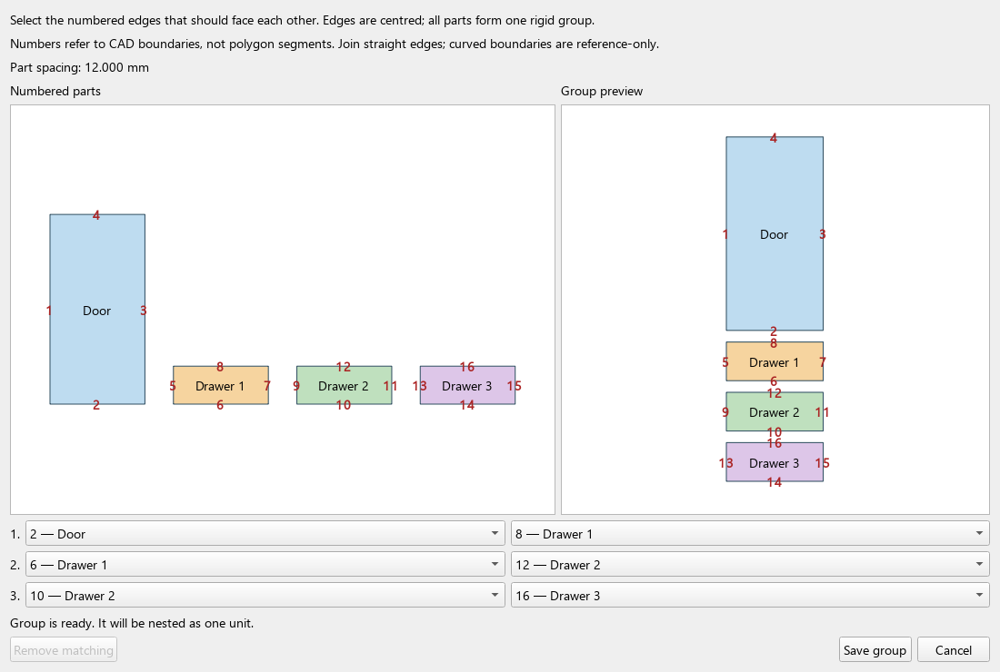

Šeit atrodas tikai pēdējā strādājošā versija

### Texture matching (continuous texture)

Select at least two part rows and click **Match texture**, below **Mark selected
part holes**. The editor numbers native CAD boundaries across all selected parts,
not the line segments used to approximate curves for nesting. Each curved
boundary has a single grey reference number; choose straight edges to join
parts. Curved references are disabled in the edge selectors.
For N parts, select N−1 pairs of edges to join. The live preview centres each
pair of edges and separates them by the current part spacing, in millimetres.
The group preview starts empty and shows connected parts after the first pair
is selected. Cycles name the still-unconnected parts and retain the valid partial
preview. Connections must form one connected group without overlaps. Save the group;
select any member and click the button again to edit or remove its connections.



The engine receives one ordinary rectangular perimeter enclosing the assembled
parts. It receives no group, member or texture-matching data. Python retains the
relative poses and original shape snapshots in `nesting_session.json`, then
expands every returned perimeter placement into separate original FreeCAD
parts, including the perimeter's rotation. Keep the session alongside its
`result.json` when transferring a job. Matching definitions are also stored
in the preview document and persist when that document is saved as FCStd.

This initial version centres adjoining edges, requires equal quantities for
all members, and reserves a rectangular envelope (including gaps and unused
corners). Rotation rules are intersected across members. Spacing changes are
applied on export; geometry changes require reopening and confirming the group.
The expanded result's utilisation uses actual part areas. The engine's offcut
report describes the reserved envelopes, not the free space between group
members. English and Latvian editor captions are provided initially.

Run the mathematical and native integration tests from the repository root:

```powershell
& 'C:\Program Files\FreeCAD 1.0\bin\python.exe' -m unittest discover -s tests -p test_grain_match_model.py
& 'C:\Program Files\FreeCAD 1.0\bin\python.exe' tests/freecad_grain_matching.py
```

The integration test uses FreeCAD 1.0, its bundled Python/PySide and the bundled
CLI. Set `CLINESTING_EXE` to test another executable, or `GRAIN_MATCH_SCREENSHOT`
to save a screenshot of the editor. It checks real table selection, group
editing/removal, FCStd persistence, engine-only perimeter export, two rotated
copies, 12 mm spacing, original 3D holes and continuous result updates.
Curved-profile regressions also check native boundary numbering, partial previews,
cycle diagnostics and saved boundary mappings. Legacy straight-edge links are
migrated when the editor opens; links to curve fragments require reselection.

**Import DXF** supports selecting multiple files with Ctrl/Shift or Ctrl+A.
Each file becomes a separate part row with quantity 1 and the configured default
rotation count. The preview layout is refreshed once after the batch. Files that
fail to import are listed in one warning; remaining files are still processed.

The batch import regression uses real Qt tables and FreeCAD geometry, with
temporary DXF fixtures and a mocked file chooser. Run it with FreeCAD's bundled
Python from the repository root, for example on Windows:

```powershell
& 'C:\Program Files\FreeCAD 1.0\bin\python.exe' tests/freecad_dxf_batch_import.py
```


GPU discovery is explicit: use **Show GPU's** next to the GPU device setting.
The **Looking for graphic cards** progress window is painted before a background
worker starts `clinesting --list-gpus`. Opening the workbench or changing GPU
on/off does not enumerate devices. Auto selection and a saved GPU index remain
available without a scan.

**Run nesting** paints its progress window before exporting the job. Export
processes sheets and parts between Qt event-loop turns, reuses each part's contour
for its outline, selected holes and immutable shape snapshot, and starts the CLI
process in a background worker. FreeCAD geometry/recompute operations stay on the
UI thread; a single expensive geometry operation can still delay repainting.
Cancel also works before export or while the operating system is creating the
process. A cancelled late process is stopped before the workbench job lock is
released. The CLI executable and nesting algorithms are unchanged.


Machined panels with blind drilling and grooves use their complete XY footprint.
The exporter proves that the footprint encloses all material instead of requiring
an identical cross-section throughout the thickness. Only empty columns through
the full thickness are exposed as holes. Original BREP geometry and face
orientation are preserved for result placement; disconnected material and solids
extending beyond the proven footprint remain rejected.
